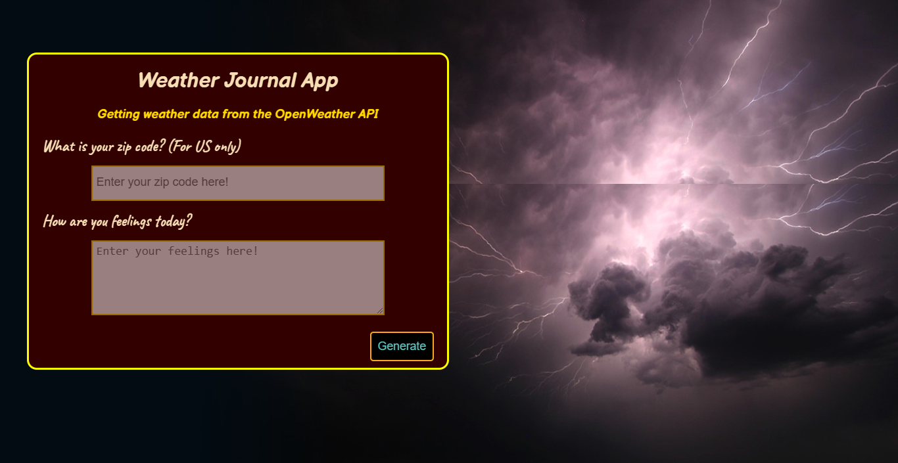

# Weather Journal App

## Project 3 - Weather Journal App (Front End Developer Udacity Nanodegree)

### Created with HTML, CSS, Javascript (Vanilla), and Node.js

### Project Objective

This project was about working with Web APIs and asynchronous code, creating a web app that uses OpenWeatherMap API to get weather based on user's location, and dynamically update UI.

### Building
To get the project up and running I followed these steps:

1. Setting up project environment, making sure I have Node and packages installed, and included in my server.js file.
1. Added POST and GET routes to ensure correct retrieval of data from the server.
1. Acquired API credentials from OpenWeatherMap website.
1. Created async functions to fetch weather data and store it on my local server. 
1. Set up a function that updated UI dynamically.

## --- Getting started ---

### Add your API key in the app.js file:
    key = '&APPID=ENTER YOUT KEY';

### Install node.js on your machine and then start the server at port number: 3000
    $npm server.js

### Result (input)

### Result (output)

